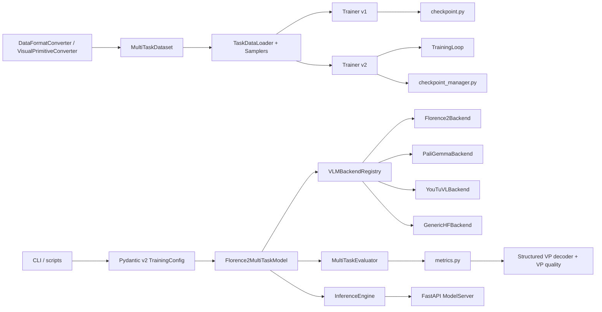

# FlorenceForge 深度分析报告

> 生成日期: 2026-06-08  
> 项目路径: `/Users/gatilin/PycharmProjects/FlorenceForge`  
> 分析对象: 当前工作区源码，包括未提交与未跟踪文件  
> 当前分支: `main`  
> 当前提交: `1e1cebe`  
> 报告文件: `docs/Deep_Analysis_2026-06-08.md`

## 0. 结论摘要

FlorenceForge 已经不只是一个 Florence-2 微调脚手架，而是一个覆盖多 VLM 后端、数据转换、训练、评估、部署、Visual Primitive 实验闭环的视觉语言模型工程框架。当前源码的核心设计方向是正确的：后端注册表、Pydantic v2 配置、Florence-2 特殊编码约束、数据层性能优化、VP 结构化评估链路，都体现出真实工程问题被持续修复后的痕迹。

项目当前最主要的问题不是“能不能跑”，而是“能力增长后的收敛成本”。训练层存在 v1/v2 双栈并存，LoRA/合并链路在 v2 和收尾导出处仍有签名不匹配风险，数据校验器与主训练 JSONL 格式不一致，部分统一门面模块未接入主路径，评估与 VP 模块增长很快但还没有完全沉淀为稳定边界。

综合判断：当前项目适合继续作为研究工程和生产试点框架推进，但在进入更高规模训练、对外发布或把 v2 设为默认训练入口之前，建议先完成三件事：

1. 修复 v2 LoRA 与模型合并链路，并补齐对应测试。
2. 统一数据格式契约，至少明确 `image/prefix/suffix` 与 `image/conversations` 两类 schema 的适用场景。
3. 确定训练栈收敛路线，避免 v1、v2、双 CheckpointManager、双式配置入口继续扩散。

## 1. 分析方法

本报告基于源码阅读、静态统计和局部测试验证，不依赖历史文档的旧结论。使用过的主要核验方式如下：

| 项目 | 方法 | 结果 |
| --- | --- | --- |
| 文件发现 | `rg --files`、`find` | 当前包内 120 个 Python 文件 |
| 代码规模 | `wc -l`、AST 统计 | `florence_forge` 约 46,100 LOC，166 个 class，1,511 个函数/方法 |
| 测试规模 | `pytest --collect-only -q` | 收集到 747 个测试 |
| 代表性测试 | `python3 -m pytest -q tests/test_lora_manager.py tests/test_training_integration.py tests/test_data_validator.py tests/test_metrics.py tests/test_structured_vp_decoder.py` | 70 个测试通过 |
| 语法检查 | `python3 -m compileall -q florence_forge` | 通过 |
| Git 状态 | `git status --short` | 25 个已跟踪文件修改，46 个未跟踪文件 |

未运行完整测试套件，也未下载真实模型权重或启动真实训练。报告中的运行性判断以静态源码、已有测试和轻量验证为依据。

## 2. 项目当前画像

### 2.1 规模概览

| 指标 | 当前值 |
| --- | ---: |
| 主包 Python 文件 | 120 |
| 主包代码行数 | 46,100 |
| 测试 Python 文件 | 62 |
| 测试代码行数 | 14,664 |
| pytest 收集用例 | 747 |
| scripts 文件 | 183 |
| configs 文件 | 41 |
| `florence_forge` class 数 | 166 |
| `florence_forge` 函数/方法数 | 1,511 |

### 2.2 子包规模

| 子包 | 文件数 | LOC | 观察 |
| --- | ---: | ---: | --- |
| `evaluation` | 28 | 13,375 | 当前最大子系统，VP 质量评估与 benchmark 扩展明显 |
| `training` | 20 | 9,137 | v1/v2 双栈并存，是结构性技术债中心 |
| `data` | 15 | 5,918 | 数据读取、转换、缓存、采样能力较完整 |
| `utils` | 15 | 5,651 | 设备、内存、IO、安全加载等基础设施齐全 |
| `core` | 14 | 4,808 | 配置、任务、模型、后端抽象的核心承重层 |
| `deployment` | 6 | 3,075 | 推理引擎和 FastAPI 服务较完整，但导出/后端仍有占位能力 |
| `cli` | 5 | 2,586 | 已从单文件 CLI 拆出 commands/helpers |
| `experimental` | 12 | 470 | MoE 实验隔离较好 |
| `optimization` | 2 | 446 | 量化入口清晰，但依赖后端环境较强 |

### 2.3 当前工作区状态

当前工作区不是干净发布态，而是一个活跃开发态：

| 状态 | 数量 |
| --- | ---: |
| 已跟踪修改文件 | 25 |
| 未跟踪文件 | 46 |
| `git diff --stat` | 2,012 行新增，207 行删除 |

这对分析结论很重要。当前 VP 相关模块、结构化解码、部分测试与文档看起来属于正在推进的增量工作。如果要做发布或 PR，建议先把这些文件分组提交，避免“功能实现、实验脚本、报告文档、测试”混在一个变更里。

## 3. 高层架构



### 3.1 架构主线

项目采用比较典型的 ML 框架分层：

1. `core` 负责配置、任务注册、模型封装和 VLM 后端抽象。
2. `data` 负责格式转换、JSONL 数据集、图像缓存、采样器和 collator。
3. `training` 负责训练器、优化器、调度器、LoRA、checkpoint、监控和可视化。
4. `evaluation` 负责普通评估、benchmark、高级指标和 VP 质量分析。
5. `deployment` 负责推理、服务化、导出和部署后端。
6. `cli` 与 `scripts` 负责把上述能力暴露给命令行和实验流程。

### 3.2 架构成熟度判断

| 维度 | 评分 | 说明 |
| --- | ---: | --- |
| 分层清晰度 | 4.0 / 5 | 主目录边界清楚，后端和评估拆分较好 |
| 核心抽象质量 | 4.2 / 5 | VLM 后端注册表、Florence-2 特殊编码处理是亮点 |
| API 收敛程度 | 3.1 / 5 | v1/v2 训练器、双 checkpoint、双数据校验 schema 增加认知成本 |
| 测试资产 | 4.0 / 5 | 747 个测试，关键工具层覆盖较多，但高风险分支仍有缺口 |
| 发布稳定性 | 3.3 / 5 | 当前工作区有大量未提交文件，部分新增能力仍像实验态 |
| 综合成熟度 | 3.7 / 5 | 适合继续工程化，但需要一次收敛型迭代 |

## 4. 核心模块分析

### 4.1 `core`: 配置、任务与后端抽象

`core/config.py` 已迁移到 Pydantic v2，配置对象具备字段校验、alias 兼容、未知字段告警和序列化能力。`TrainingConfig` 使用 `model_settings`、`data_settings` 等字段，同时通过 `alias="model_config"` 等方式兼容 YAML 旧键名，这是正确的迁移方式。

亮点：

- `WarnOnUnknownFieldsModel` 对未知字段发出 warning，而不是静默吞掉所有历史配置错误。
- `ModelConfig` 覆盖多后端、LoRA、gradient checkpointing、`torch.compile`、Visual Primitive token 等能力。
- `TrainingConfig` 明确了 `max_steps` 优先于 `num_epochs` 的语义，并在同时设置时告警。
- `architecture_resolver.py` 已降级为 `VLMBackendRegistry` 上的兼容门面，避免双注册源继续分叉。

风险：

- 配置仍有顶层训练字段和嵌套字段并存，例如 `TrainingConfig.learning_rate` 与 `optimization_settings.learning_rate`。v2 trainer 已偏向嵌套配置，但历史入口和测试仍会碰到顶层字段。
- `TrainingConfig.model_config = ConfigDict(...)` 是 Pydantic 保留名，虽然当前处理正确，但对用户来说 `model_config` 既像业务模型配置又像 Pydantic 配置，文档需要反复强调。
- 任务注册表中 Florence-2 原生任务与 VP alias 任务合并在同一个 `FLORENCE2_TASKS` 字典里，短期方便，长期可能需要区分 `native_task`、`derived_task`、`experimental_task`。

### 4.2 `core/backends`: VLM 后端层

`BaseVLMBackend` 把模型加载、processor、encode、generate、decode、forward、save/load、模型信息等公共逻辑放在统一基类中，`Florence2Backend` 只保留 Florence-2 特有逻辑。这是当前项目最稳的抽象之一。

特别值得保留的设计：

- `_load_with_cpu_fallback()` 只对设备、精度、attention 相关错误做 CPU fallback，避免掩盖配置或网络错误。
- `_move_tensors_to_device()` 在 generate/forward 前递归迁移 kwargs 中的 tensor，能减少 CPU/CUDA 混用问题。
- `Florence2Backend.encode_with_task()` 显式处理 Florence-2 processor 的 task token 独占约束，并通过 `prompt_lengths` 构造 label mask。
- `enable_visual_primitives` 开关默认关闭，避免 VP token 扩展影响普通 Florence-2 用户。

当前后端层判断：设计方向优秀，继续新增模型后端时应坚持 registry + backend 自治编码，而不是把模型特殊规则散到 dataset/trainer 里。

### 4.3 `core/model.py`: 模型封装层

`Florence2MultiTaskModel` 是上层统一模型 wrapper，通过 `_backend` 代理底层模型和 processor。它同时处理 LoRA 注入、图片级 generate、张量级 generate、`predict_task()` 和保存/加载。

优点：

- 延迟加载模型，避免 import 时拉起大模型。
- `__getattr__` 对 PEFT 依赖的 generation 属性做白名单透传，解决 PEFT 与 wrapper 模型之间的接口摩擦。
- 图片级和张量级 generate 共存，能服务 CLI 推理、评估与训练循环。

需要注意：

- `ModelMerger.merge_and_unload()` 中尝试通过 `Florence2MultiTaskModel.__new__()` 手动构造 wrapper，再设置 `model` 属性。这绕过了 `nn.Module.__init__` 和 `_backend` 初始化，属于高风险做法。正确方式应是正常构造 `Florence2MultiTaskModel(ModelConfig(...))`，然后把已合并的 HF model 接到 backend 上，或提供专门的 `from_backend_model()` 工厂。
- `load_pretrained()` 将 `is_peft_model` 传给 backend 的 `load_pretrained()`，但 `BaseVLMBackend.load_pretrained()` 当前只接受 `model_path, **kwargs` 并忽略 PEFT 语义。LoRA 模型加载应明确走 PEFT 路径或文档标注限制。

### 4.4 `data`: 数据管线

数据层已经具备框架级能力，不是简单 JSONL reader。

亮点：

- `MultiTaskDataset` 支持预加载和 lazy load 两种模式。
- lazy load 使用二进制扫描记录 byte offset，使随机访问从历史 O(n) 降到 O(1) seek。
- 图像加载抽到 `image_cache.py`，提供按字节预算的 LRU payload cache。
- `Florence2Collator` 支持动态 padding，labels 用 `-100` padding，非 tensor 字段保留为列表。
- `TaskDataLoader` 支持 balanced、round_robin、random 三类采样，并有分布式采样包装。
- 当 dataset 依赖 processor 在线编码且 `num_workers > 0` 时，会自动降到 0，避免 worker 中 processor/backend 丢失后产生未编码样本。
- `MultiTaskDataset.__getitem__()` 优先走 backend 的 `encode_with_task()`，把 Florence-2 特殊训练编码交回后端，这是正确边界。

主要问题：

- `data/validator.py` 的主 schema 是 `image + conversations`，而 README、converter、dataset 主训练路径使用 `image + prefix + suffix`。这会造成用户用 CLI/validator 校验训练 JSONL 时被错误拒绝。
- `data/converter.py` 内部还存在另一个 `DataValidator` 类，`data/__init__.py` 导出的是 `data/validator.py` 的 `DataValidator`。同名不同契约会增加维护风险。
- CLI `_prepare_datasets()` 固定 `image_base_path="./data/images"`。绝对路径不会受影响，但相对路径默认不是相对数据文件所在目录，而是相对固定目录，这与很多 JSONL 数据集习惯不一致。

建议将数据 schema 明确拆成：

| Schema | 字段 | 用途 |
| --- | --- | --- |
| FlorenceForge training JSONL | `image`, `prefix`, `suffix`, 可选 `text_input`, `region`, metadata | 训练和 converter 输出 |
| Conversation JSONL | `image`, `task_type`, `conversations` | VQA/对话类外部格式或导入格式 |

然后让 validator 支持 `--schema training|conversation|auto`。

### 4.5 `training`: 训练系统

训练层是当前项目的最大架构债来源，但也保留了最多成熟能力。

当前存在两套训练器：

| 训练栈 | 入口 | 状态 |
| --- | --- | --- |
| v1 | `florence_forge.training.trainer.MultiTaskTrainer`，也是默认导出 | 功能最完整，包含 FSDP/DeepSpeed、LoRA、多任务 adapter、异步 checkpoint、callback、监控、可视化 |
| v2 | `florence_forge.training.trainer_refactored.MultiTaskTrainer` | 模块化，组合 `TrainingLoop`、`CheckpointManager`、`DeviceConfigurator`，测试覆盖较好，但 LoRA/合并分支存在明显问题 |

v1 的主要价值是功能完整。v2 的主要价值是边界更清晰。当前不建议继续长期双栈维护，应该用一次迁移计划决定默认入口。

#### 4.5.1 v2 LoRA/合并链路问题

静态核验发现几个高优先级问题：

1. `trainer_refactored.py` 中 `LoRAManager(self.model, self.config.model_settings.lora_config)` 与 `LoRAManager.__init__(base_config=None)` 不匹配。
2. `trainer_refactored.py` 调用 `self.lora_manager.apply_lora()`，但 `LoRAManager` 没有 `apply_lora()` 方法，真实方法是 `apply_lora_to_model(model, task_name, adapter_name=None)`。
3. `checkpoint_manager.py::save_final_model()` 中 `ModelMerger(self.model, lora_manager)` 与 `ModelMerger.__init__(lora_manager=None)` 不匹配。
4. `trainer_refactored.py::save_merged_model()` 也有同样的 `ModelMerger(self.model, self.lora_manager)` 签名问题。
5. `ModelMerger.merge_and_unload()` 用 `__new__` 绕过 wrapper 初始化，合并后模型对象可能不具备合法 `_backend` 状态。

代表性测试中 v2 主干使用 `ModelConfig(use_lora=False)`，因此这些问题没有被挡住。建议新增 `tests/test_training_v2_lora.py`，覆盖：

- v2 `setup_training()` 在 `use_lora=True` 时能正确注入首个 adapter。
- v2 final model 保存时 `merge_lora=True` 不会因 `ModelMerger` 签名崩溃。
- `ModelMerger.merge_and_unload()` 返回的对象能 `save_pretrained()`、`generate()` 或至少 `get_model_info()`。

#### 4.5.2 Checkpoint 双实现

项目同时有：

- `training/checkpoint.py`: v1 函数式工具集。
- `training/checkpoint_manager.py`: v2 OO 生命周期版。
- `_checkpoint_io.py`: 已抽出的原子写和安全加载原语。

底层原语已统一，这是好方向。下一步应让 `checkpoint.py` 逐步变成 thin shim，主实现集中到 `checkpoint_manager.py`。

### 4.6 `evaluation`: 评估与 VP 质量体系

`evaluation` 是当前最大的子系统，且增长方向集中在两类能力：benchmark 工程化与 Visual Primitive 质量闭环。

亮点：

- `MultiTaskEvaluator` 处理 encoder-decoder 与 decoder-only generate 输出差异，只有生成结果确实包含 prompt 前缀时才裁剪。
- `metrics.py` 对 caption、detection、OCR、segmentation、visual primitive detection 做了任务路由。
- `benchmark.py` 已拆出 cache、parallel、reports、statistics、monitoring、lazy metrics，主文件不再承载所有逻辑。
- `StructuredVisualPrimitiveDecoder` 能将 Florence native `label<loc_*>` 输出确定性包装为 VP `ref + box` 证据链。
- `vp_detection_quality.py` 提供 precision/recall/F1、box count bucket、bad cases、policy comparison、record-level comparison 等一整套实验分析工具。

风险：

- `vp_detection_quality.py` 已到 1,707 行，是当前最大单文件。它有大量渲染、比较、推荐、聚合函数，建议拆成 `quality.py`、`comparison.py`、`rendering.py`、`policies.py`。
- `unified_metrics.py` 当前没有被任何生产路径引用，且文件说明称“合并 _metrics.py 和 _metrics_calculator.py”，但当前实际主路径仍是 `metrics.py` 和 lazy advanced calculators。这类未接线统一门面容易误导后续维护者。
- advanced metrics 存在算法核心和 calculator 适配层双层设计，这本身不一定冗余，但应在 README 或模块 docstring 说明边界。

### 4.7 `deployment`: 推理与服务化

部署层已有可用雏形：

- `InferenceEngine` 支持本地 `nn.Module`、TorchScript、`.pt/.pth`、HF 模型目录/Hub ID、LoRA 目录识别。
- 本地 torch 文件默认走 `safe_torch_load(weights_only=True)`，需要 unsafe pickle 时必须显式允许，这是重要安全防线。
- `ModelServer` 基于 FastAPI，提供 `/predict`、`/predict/batch`、`/health`、`/stats`、`/model/info`。
- `InferenceBackend` 抽象允许未来接入更多 serving 后端。

注意点：

- `VLLMInferenceBackend` 是明确占位，选择后会 fail loudly，这比半实现更安全。
- FastAPI CORS 默认 `allow_origins=["*"]`，适合本地开发，不适合公网部署默认值。
- `ModelExporter` 与 `ModelMerger` 都包含 ONNX/TorchScript/TensorRT 相关逻辑，但 Florence-2 remote code + multimodal 输入对导出很敏感，应在文档中标注“实验/尽力而为”。

### 4.8 `cli` 与 `scripts`

CLI 已经从单一主文件拆成：

- `main.py`: 参数解析、任务列表、配置校验、doctor。
- `commands.py`: train/infer/eval/serve/convert 等重型 handler。
- `_helpers.py`: task mapping、图片后缀、推理统计规范化。
- `config_manager.py`: 配置管理工具。

亮点：

- 推理命令已经支持 structured VP JSON 输出。
- `doctor` 能输出环境诊断。
- 数据转换覆盖常规 YOLO/COCO/CSV/XML/OCR，也覆盖 VP COCO/YOLO/query grounding。

主要改进点：

- `run_training_task()` 仍默认导入 v1 trainer，这是稳定优先的选择，但与 v2 文档推荐方向需要统一口径。
- `_prepare_datasets()` 中 `image_base_path="./data/images"` 是隐性默认，建议加入配置项或按 data path 所在目录解析。
- `scripts/` 规模很大，包含 examples、smoke、experiments、performance、testing、data-conversion。建议将“长期维护脚本”和“一次性实验脚本”分目录标注。

## 5. Visual Primitive 当前状态

当前 VP 已经不是纯文档设想，源码里已出现较完整的 Layer 1 工程闭环：

| 能力 | 当前承载 |
| --- | --- |
| VP token 定义与格式化 | `core/visual_primitives.py` |
| VP 任务注册 | `core/tasks.py` 中 `OD_VP`、`COUNT_VP`、`PHRASE_GROUNDING_VP` |
| tokenizer/model resize | `Florence2Backend._maybe_add_visual_primitive_tokens()` 与 `_maybe_resize_for_visual_primitives()` |
| COCO/YOLO 转 VP | `data/vp_converter.py` |
| VP parser | `evaluation/visual_primitive_parser.py` |
| native loc 到 VP wrapper | `evaluation/structured_vp_decoder.py` |
| VP 质量指标 | `evaluation/metrics.py`、`evaluation/vp_detection_quality.py` |
| VP 实验脚本 | `scripts/experiments/*vp*`、`scripts/smoke/*vp*` |
| VP 测试 | `tests/test_visual_primitives.py`、`tests/test_vp_converter.py`、`tests/test_structured_vp_decoder.py` 等 |

阶段性判断：

- 工程 MVP 方向正确：先让 Florence 原生定位输出可被结构化 decoder 包装、解析、评分、可视化。
- 研究结论还不能提前写死：短训 LoRA 是否真正内化 VP wrapper，需要更多 raw VP wrapper 生成率、adapter/base baseline 和非 VP 回归指标支持。
- `structured_vp_decoder_ratio` 这类指标很关键，因为它能区分“模型自己会写 VP wrapper”和“后处理把 native loc 包成 VP”。

建议 VP 后续实验使用两个明确目标：

1. 工程目标：structured VP 输出稳定可用，服务推理、评估、bad case 分析。
2. 研究目标：raw VP wrapper 直接生成率在不牺牲定位质量的前提下提升。

## 6. 风险清单

### P0: 应优先修复

| ID | 问题 | 影响 | 建议 |
| --- | --- | --- | --- |
| P0-1 | v2 LoRA 初始化调用与 `LoRAManager` 接口不匹配 | `use_lora=True` 的 v2 训练路径可能直接失败 | 修正为 `LoRAManager(config)` + `apply_lora_to_model(model, first_task)`，并补测试 |
| P0-2 | `CheckpointManager.save_final_model()` 和 v2 `save_merged_model()` 调用 `ModelMerger` 签名不匹配 | 训练收尾合并 LoRA 时可能失败 | 统一 `ModelMerger` 构造签名，或新增明确的 `ModelMerger(model, manager)` API |
| P0-3 | `ModelMerger.merge_and_unload()` 绕过 `Florence2MultiTaskModel` 初始化 | 合并后 wrapper 状态不完整，保存/推理不稳定 | 用正常构造或专用工厂创建带 backend 的 wrapper |
| P0-4 | `DataValidator` 与主训练 JSONL schema 不一致 | 用户校验通过/失败与训练能否加载不一致 | validator 支持 `training` schema，并更新 CLI 文档 |
| P0-5 | 当前工作区大量未跟踪 VP/评估文件 | 发布和回滚风险高 | 按主题提交，至少拆为 VP core、VP eval、CLI、tests、docs |

### P1: 架构收敛

| ID | 问题 | 影响 | 建议 |
| --- | --- | --- | --- |
| P1-1 | v1/v2 训练栈长期并存 | API 学习成本、测试矩阵、bug 修复成本翻倍 | 明确版本计划，先让 v2 覆盖 LoRA/merge 后再切默认 |
| P1-2 | 双 checkpoint manager | 用户和内部调用路径易混 | `checkpoint.py` 变 thin shim，主实现集中到 `checkpoint_manager.py` |
| P1-3 | `unified_metrics.py` 未接入生产路径 | 维护者误判指标入口 | 接入 benchmark/evaluator，或移到 experimental/删除 |
| P1-4 | `vp_detection_quality.py`、`trainer.py`、`dataset.py` 等巨石文件 | 局部改动容易牵动大文件 | 先按纯函数边界拆 VP rendering/comparison/policy |
| P1-5 | CLI 数据路径默认不够透明 | 相对图片路径可能解析到意外目录 | `image_base_path` 放进配置或以数据文件父目录为默认 |

### P2: 产品化与运维

| ID | 问题 | 影响 | 建议 |
| --- | --- | --- | --- |
| P2-1 | FastAPI CORS 默认全开放 | 公网部署不安全 | 增加 `allowed_origins` 配置，默认本地安全值 |
| P2-2 | 导出/量化后端依赖复杂 | 用户容易误以为全平台稳定 | 文档明确支持矩阵和降级行为 |
| P2-3 | scripts 目录实验脚本过多 | 新用户难判断哪个脚本可依赖 | 标注 `stable/experimental/archive` 或在 README 列出推荐入口 |
| P2-4 | 训练可视化、推理引擎文件仍偏大 | 后续功能迭代成本增加 | 将可视化报表渲染、状态统计、图像绘制拆出 |

## 7. 测试与质量

### 7.1 已验证结果

本次轻量验证结果：

```text
python3 -m compileall -q florence_forge
结果: 通过

python3 -m pytest --collect-only -q
结果: 成功收集 747 个测试

python3 -m pytest -q \
  tests/test_lora_manager.py \
  tests/test_training_integration.py \
  tests/test_data_validator.py \
  tests/test_metrics.py \
  tests/test_structured_vp_decoder.py
结果: 70 passed
```

### 7.2 测试优点

- 后端 registry、PaliGemma、YouTuVL、GenericHF 都有 mock 测试。
- 数据 pipeline、collate、cache、device、text/image utils 覆盖较多。
- v2 training loop 有集成测试，覆盖 max_steps、load_best_model_at_end、metadata 过滤等关键行为。
- VP 相关测试已覆盖 converter、parser、quality、structured decoder、实验脚本辅助逻辑。
- 安全加载与 optional dependency 提示有专门测试。

### 7.3 测试缺口

优先补这些测试：

1. v2 trainer `use_lora=True` 的 `setup_training()`。
2. `CheckpointManager.save_final_model(merge_lora=True)`。
3. `ModelMerger.merge_and_unload()` 返回 wrapper 的保存和推理最小行为。
4. `DataValidator` 校验 `image/prefix/suffix` training JSONL。
5. CLI training 数据路径解析，尤其是相对 image path。
6. `unified_metrics.py` 的去留决策。如果保留，需要测试它和主 evaluator/benchmark 的接线。

## 8. 推荐路线图

### 第一阶段: 修复高风险断点

目标：让 v2 LoRA、合并、数据校验契约变得可信。

建议任务：

1. 修正 v2 `LoRAManager` 调用和 `apply_lora` 方法误用。
2. 修正 `ModelMerger` 构造和 `merge_and_unload()` wrapper 创建方式。
3. 给 v2 LoRA 和 merge_lora final save 加测试。
4. 给 `DataValidator` 加 training schema 支持。
5. 更新 README 中“数据格式”和“validate”说明。

### 第二阶段: 训练栈收敛

目标：决定 v1/v2 的默认关系，减少双栈维护。

建议任务：

1. 做 v1/v2 能力对照表，以真实测试标记完成度。
2. v2 补齐 v1 必要能力后，将默认导出切到 v2。
3. v1 保留一个版本的 deprecation warning。
4. `checkpoint.py` 变成兼容层。
5. 所有新示例改用统一训练入口。

### 第三阶段: VP 质量闭环产品化

目标：把 VP 从实验增量沉淀成稳定可选能力。

建议任务：

1. 拆分 `vp_detection_quality.py`。
2. 标准化 VP 实验输出目录和 summary schema。
3. 在 CLI 中明确 `structured_vp_mode=off|auto|on` 的语义。
4. 记录 raw wrapper、structured decoder、base/adapter baseline 三组指标。
5. 增加非 VP 任务回归测试，避免 VP token/LoRA 改造损害普通任务。

### 第四阶段: 发布准备

目标：从活跃工作区变成可发布版本。

建议任务：

1. 清理未跟踪文件，按主题提交。
2. 运行完整测试套件和最低覆盖率报告。
3. 明确部署安全默认值。
4. 对实验能力标注 `experimental`，避免用户误用。
5. 生成 changelog，说明从上一版到 2026-06-08 的 VP 和训练栈变化。

## 9. 建议拆分的模块

| 当前文件 | 当前 LOC | 建议拆分 |
| --- | ---: | --- |
| `evaluation/vp_detection_quality.py` | 1,707 | `quality_core.py`、`quality_records.py`、`quality_compare.py`、`quality_render.py`、`policy_recommendation.py` |
| `training/trainer.py` | 1,385 | 等 v2 稳定后不再拆，直接迁移并弃用 |
| `data/dataset.py` | 1,309 | `sample.py`、`lazy_index.py`、`encoding.py`、`cache.py` |
| `deployment/inference.py` | 1,270 | `model_loading.py`、`prediction.py`、`visualization.py`、`stats.py` |
| `training/visualizer.py` | 1,265 | `plots.py`、`html_report.py`、`dashboard.py` |
| `data/converter.py` | 1,230 | 按格式拆分为 `converters/yolo.py`、`coco.py`、`csv.py`、`ocr.py` |
| `evaluation/analyzer.py` | 1,195 | 聚类、可视化、错误分析拆分 |

拆分原则：优先拆新增或仍在快速变化的模块。`trainer.py` 如果计划弃用，不建议继续投入大规模重构。

## 10. 最终判断

FlorenceForge 的当前状态可以概括为：

- 核心抽象已经建立，尤其是 VLM backend 和 Florence-2 编码路径。
- 数据与评估能力已经进入框架级别，VP 方向具备清晰的工程 MVP。
- 测试资产足以支持继续重构，但几个高风险分支需要补测试。
- 最大问题是架构收敛，而不是单点功能缺失。

建议短期不要继续横向堆新功能。先完成 LoRA/merge 修复、schema 统一、训练栈收敛这三个动作。完成后，项目成熟度可以从当前的 `3.7/5` 提升到接近 `4.2/5`，也更适合作为后续 VP 研究和生产推理服务的稳定底座。
