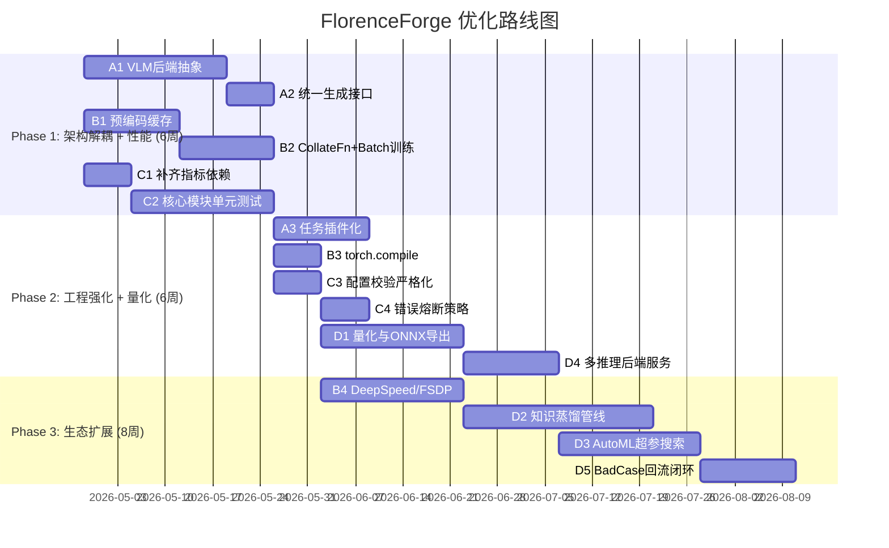

# FlorenceForge 框架深度分析：SWOT 矩阵与优化方案

> **分析日期**: 2026-04-25  
> **分析范围**: `florence_forge/` 核心源码、`pyproject.toml`、`README.md`、CLI 工具链、训练/评估/部署全链路  
> **分析目标**: 识别框架在当前多模态微调生态中的竞争位置，输出可落地的优化路线图

---

## 1. 执行摘要

FlorenceForge 是一个围绕 **Microsoft Florence-2** 视觉语言模型构建的**多任务微调框架**。其设计哲学是"一站式": 从数据格式转换(YOLO/COCO/CSV/XML)、多任务混合训练(LoRA)、多平台实验监控(WandB/SwanLab/TensorBoard) 到 FastAPI 推理部署，全部封装在统一的 CLI 与 Python API 之下。

**核心判断**: 框架在**易用性与功能完整性**上表现突出，但在**架构解耦、性能工程、测试覆盖**三个维度存在显著技术债务。若能在短期内完成解耦与性能优化，中期引入量化蒸馏与 AutoML，长期构建多模型后端生态，则具备从 "Florence-2 专用工具" 进化为 "通用视觉语言微调平台" 的潜力。

---

## 2. 框架架构快照

```
florence_forge/
├── core/               # 模型封装 (Florence2MultiTaskModel)、配置(dataclass)、任务注册表
├── training/           # 多任务训练器、LoRA管理器、任务调度器、梯度/内存监控
├── data/               # 多任务数据集(JSONL)、TaskDataLoader、多格式转换器(YOLO/COCO/CSV...)
├── evaluation/         # 多任务评估器、任务级指标(Caption/Detection/OCR/Seg)
├── deployment/         # FastAPI服务、推理引擎(InferenceEngine)、ONNX导出(规划)
├── cli/                # 统一命令行入口 (train/infer/convert/validate/generate-config)
└── utils/              # 图像处理、设备管理、内存监控、可视化
```

**关键依赖栈**: PyTorch 2.0+ | Transformers 4.35+ | PEFT | Accelerate | FastAPI | Pillow/OpenCV

---

## 3. SWOT 深度分析

### 3.1 Strengths（优势）

| # | 优势维度 | 源码证据 | 竞争价值 |
|---|---------|---------|---------|
| S1 | **多任务统一微调** | `core/tasks.py` 定义了 14+  Florence-2 原生任务；`MultiTaskDataset` 支持任务权重与平衡采样 | 用户无需为每个任务维护独立代码库，降低多任务研发成本 |
| S2 | **参数高效微调(PEFT)原生集成** | `core/model.py:282-308` 自动注入 LoRA；`training/lora_manager.py` 支持多任务适配器切换 | 显存占用从全参数训练的 ~40GB 降至 ~12GB(base)，硬件门槛大幅降低 |
| S3 | **智能设备与精度适配** | `trainer.py:238-312` 自动检测 CUDA/MPS/CPU，智能选择 BF16/FP16/FP32；`model.py:137-195` 设备回退机制 | 新手用户无需手动配置 `device_map` 和 `torch_dtype`，开箱即用 |
| S4 | **完整的 CLI 工具链** | `cli/main.py` 提供 `train/infer/convert/validate/list-tasks/generate-config` 6 大命令 | 覆盖从数据准备到模型部署的全生命周期，降低非 Python 用户门槛 |
| S5 | **多格式数据转换生态** | `data/converter.py` 支持 YOLO↔OD、COCO↔OD、CSV↔Caption、VOC XML↔OD、TXT↔OCR 等 7+ 格式 | 极大缩短数据预处理时间，对已有标注资产的企业用户价值极高 |
| S6 | **训练可观测性完善** | `training/monitoring.py` 同时对接 WandB/SwanLab/TensorBoard；CSV 日志记录每一步的 data/fwd/bwd/opt 耗时 | 精细化性能分析 + 多平台实验对比，适合生产级训练 |
| S7 | **任务调度策略丰富** | `training/scheduler.py` 支持 round_robin / weighted / curriculum 三种采样策略 | 解决多任务训练中的任务冲突与负迁移问题 |
| S8 | **代码健壮性与兼容性** | 源码中大量 `try/except ImportError` 降级逻辑（如 `flash_attn` 缺失时回退 `eager`） | 在不同硬件/软件环境下的存活率高，降低部署翻车概率 |

**优势总结**: FlorenceForge 的护城河不在于某个单点算法，而在于**"围绕 Florence-2 的全链路工程封装"**。对于已经决定使用 Florence-2 的团队，它提供了最快的从数据到部署路径。

---

### 3.2 Weaknesses（劣势）

| # | 劣势维度 | 源码证据 | 风险等级 |
|---|---------|---------|---------|
| W1 | **与 Florence-2 深度耦合** | `core/model.py:236-258` 直接调用 `AutoModelForCausalLM.from_pretrained` 并硬编码 `trust_remote_code=True`；`generate()` 方法依赖 Florence-2 特有的 `<loc_xxx>` 坐标格式 | **高**。模型迁移成本极大，无法复用于 Qwen-VL、LLaVA 等其他 VLM |
| W2 | **数据预处理无缓存** | `data/dataset.py:254-339` 的 `__getitem__` 每次调用都执行 `processor(text=..., images=...)`，无预编码缓存机制 | **高**。CPU 预处理成为训练瓶颈，尤其是大图 + 多 worker 时 |
| W3 | **Batch 处理逻辑不完整** | `training/trainer.py:604-609` 训练循环中 `if isinstance(batch, list): sample = batch[0]` 只处理第一个样本；`dataset.py` 中 `collate_fn` 缺失 | **高**。当前实现无法发挥真实 Batch 训练的并行优势，且浪费显存 |
| W4 | **评估指标依赖未声明** | `evaluation/metrics.py` 中 BLEU 依赖 `nltk`，ROUGE 依赖 `rouge-score`，mAP 依赖 `pycocotools`，但 `pyproject.toml` 的 `dependencies` 中均未包含 | **中**。用户运行评估时会频繁遇到 `ImportError`，体验断层 |
| W5 | **推理接口双重标准** | `core/model.py:346` 的 `generate()` 接受 `PIL.Image` 输入；而 `evaluation/evaluator.py:115` 调用 `model.generate(input_ids=..., pixel_values=...)` 直接传 Tensor | **中**。同一模型暴露两套输入语义，增加维护成本与用户困惑 |
| W6 | **测试覆盖极低** | `tests/` 目录下仅 1 个测试文件；核心模块 `trainer.py`(1200+行)、`dataset.py`(491行) 均无单元测试 | **高**。重构风险大， regressions 难以发现 |
| W7 | **模型压缩缺失** | README Roadmap 中量化/剪枝/蒸馏均标记为 `[ ]` 未完成；`deployment/optimizer.py` 内容为空壳 | **中**。无法满足边缘部署与成本敏感场景 |
| W8 | **错误处理浅层化** | `data/dataset.py:214-219` 遇到 JSON 解析错误仅打印 warning 并 `continue`，可能静默丢失大量数据而不触发失败 | **中**。生产环境中可能导致训练数据分布漂移而不自知 |
| W9 | **配置校验不够严格** | `core/config.py` 的 `from_dict()` 使用 `**config_dict` 直接解包，对非法字段无警告；`optimization_config` 中 `lr_scheduler_type` 为任意字符串，无白名单校验 | **低**。用户容易因拼写错误导致训练行为异常，调试成本高 |
| W10 | **分布式训练有限** | `trainer.py` 使用 `accelerate.Accelerator`，但未实现 DeepSpeed / FSDP 集成，大模型全参数微调不可行 | **中**。对于 large 及以上版本，LoRA 仍可能显存不足 |

**劣势总结**: 框架的劣势集中于**架构耦合**、**性能工程**与**软件工程规范**三个层面。前两者限制其扩展性与效率，后者影响长期维护成本。

---

### 3.3 Opportunities（机会）

| # | 机会维度 | 市场/技术背景 | 与 FlorenceForge 的契合点 |
|---|---------|-------------|------------------------|
| O1 | **企业视觉 LLM 私有化部署需求爆发** | 金融、医疗、制造等行业对数据隐私要求高，不愿使用公有 API | FlorenceForge 的本地训练 + FastAPI 部署架构天然契合私有化需求 |
| O2 | **Florence-2 微软生态推力** | Azure ML、Copilot 等产品线对 Florence-2 有持续投入 | 框架可争取成为 "Azure 官方推荐的 Florence-2 微调方案" |
| O3 | **边缘 AI 与模型小型化** | 手机、摄像头、机器人等终端需要 <1B 参数的视觉模型 | 若引入量化(INT8/INT4) + 蒸馏，可占领边缘 VLM 微调 niche |
| O4 | **多模态 RAG 兴起** | 视觉问答 + 向量数据库(VDB) 构建知识库成为新范式 | 框架的评估指标 + 推理服务可作为 RAG pipeline 的 "视觉理解层" |
| O5 | **AutoML / HPO 工具成熟** | Optuna、Ray Tune、WandB Sweeps 等已非常成熟 | 将 AutoML 封装进 CLI（如 `florence_forge_cli train --auto-hpo`），可大幅降低超参调优门槛 |
| O6 | **数据飞轮闭环** | 框架已有数据转换 + 训练 + 评估 + 推理全链路 | 增加 "bad case 回流标注" 功能，形成持续迭代闭环 |
| O7 | **联邦学习合规场景** | 跨机构医疗影像分析等场景对联邦学习有强需求 | README 已规划联邦学习，抢先实现可建立差异化优势 |
| O8 | **开源社区多模型后端趋势** | vLLM、TGI、SGLang 等推理引擎崛起 | 将 `deployment/server.py` 抽象为可对接多种后端的统一服务层 |

---

### 3.4 Threats（威胁）

| # | 威胁维度 | 竞争态势 | 对 FlorenceForge 的影响 |
|---|---------|---------|----------------------|
| T1 | **Hugging Face 官方生态挤压** | `trl` (Transformer Reinforcement Learning)、`accelerate` 官方示例持续完善多模态训练支持 | 用户可能认为 "直接用官方工具更标准"，框架需要证明差异化价值 |
| T2 | **通用微调框架下沉多模态** | LlamaFactory、Axolotl 等通用框架已开始支持 Qwen-VL、LLaVA 等多模态模型 | 若 FlorenceForge 不能扩展到其他 VLM，将被通用框架取代 |
| T3 | **Florence-2 架构迭代风险** | 若微软发布 Florence-3 且改用新架构（如原生支持视频/3D），当前深度耦合代码需大规模重构 | 技术债务 W1 在此场景下会爆发为生存危机 |
| T4 | **竞品模型工具链更成熟** | LLaVA 的 `llava-train`、`Qwen-VL` 的官方微调脚本社区活跃度更高 | 开发者社区资源可能被分流，Issue/PR 响应速度下降 |
| T5 | **技术债务累积** | 源码中大量 `try/except` 降级逻辑和兼容性 patch 增加认知负担 | 新贡献者上手难度高，长期可能陷入维护者瓶颈 |
| T6 | **PyTorch 生态快速演变** | `torch.compile`、SDPA (Scaled Dot Product Attention)、FlexAttention 等新特性需要持续跟进 | 若不能利用新特性，训练效率将被竞品甩开 |
| T7 | **资金与人力约束** | 从 GitHub 结构看，项目规模偏向个人/小团队维护 | 长期功能迭代（如联邦学习、AutoML）需要持续投入，资源不足可能导致 roadmap 落空 |

---

## 4. 优化建议与落地方案

基于 SWOT 矩阵，我们提出 **"解耦 → 性能 → 生态"** 三阶段优化路线，每项建议均标注优先级（P0/P1/P2）与预计工作量。

### 4.1 架构解耦层（解决 W1/W5，应对 T2/T3）

| 建议 | 优先级 | 具体方案 | 预期收益 |
|------|-------|---------|---------|
| **A1. 抽象 VLM 后端接口** | P0 | 新增 `core/backends/base_vlm.py` 定义 `BaseVLMBackend`（统一 `encode`, `generate`, `processor` 接口）；将现有 Florence-2 实现移入 `core/backends/florence2_backend.py` | 6 周内可支持 Qwen-VL、LLaVA 后端，框架从 "Florence-2 工具" 升级为 "VLM 微调平台" |
| **A2. 统一生成接口语义** | P0 | 重构 `generate()` 只接受 Tensor（与 `forward()` 一致）；新增 `predict_image()` 接受 PIL Image 做前处理 | 消除 W5 的双重标准问题，API 语义清晰 |
| **A3. 任务注册表插件化** | P1 | 将 `core/tasks.py` 的硬编码任务字典改为基于 `importlib` 的插件发现机制；允许用户通过 `pip install florence-forge-task-xxx` 扩展任务 | 社区可贡献自定义任务，降低核心维护负担 |

### 4.2 性能工程层（解决 W2/W3/W10，应对 T6）

| 建议 | 优先级 | 具体方案 | 预期收益 |
|------|-------|---------|---------|
| **B1. 预编码数据缓存** | P0 | 在 `data/dataset.py` 中增加 `preprocess_and_cache()` 方法：首次加载时将 `(input_ids, pixel_values, labels)` 序列化到 `.pt` 或 `arrow` 格式；`__getitem__` 变为纯 IO 读取 | 训练吞吐提升 2-5 倍（取决于原图尺寸与 CPU 性能） |
| **B2. 完善 CollateFn + 真实 Batch 训练** | P0 | 实现 `data/collate.py` 的 `Florence2Collator`，支持动态 padding 与 attention_mask 构建；修复 `trainer.py` 中 `sample = batch[0]` 的单样本逻辑 | 显存利用率提升 30%+，训练速度线性扩展 |
| **B3. 引入 torch.compile 与 SDPA** | P1 | 在 `core/model.py` 中增加 `use_compile` 配置，对 `self.model` 包裹 `torch.compile()`；自动优先使用 `attn_implementation="sdpa"` 替代 `eager` | 训练速度提升 10-20%（A100/H100 上更显著） |
| **B4. DeepSpeed / FSDP 集成** | P1 | 在 `training/trainer.py` 中扩展 `accelerator` 初始化逻辑，支持通过配置启用 DeepSpeed ZeRO-2/3 或 FSDP | 支持 Florence-2-large 全参数微调，突破 LoRA 表达能力上限 |

### 4.3 软件工程层（解决 W4/W6/W8/W9）

| 建议 | 优先级 | 具体方案 | 预期收益 |
|------|-------|---------|---------|
| **C1. 补齐可选依赖与指标库** | P0 | 在 `pyproject.toml` 新增 `[evaluation]` extras：`nltk`, `rouge-score`, `pycocotools`, `editdistance`；运行时优雅提示安装命令 | 消除评估阶段的 ImportError 断层 |
| **C2. 核心模块单元测试覆盖** | P0 | 为 `dataset.py`, `trainer.py`, `metrics.py`, `config.py` 编写 pytest 单元测试，目标行覆盖率达到 70%+；利用 `accelerate` 的 `cpu` 后端在 CI 中跑通训练流程 | 重构风险可控，PR 合并有质量门禁 |
| **C3. 严格配置校验** | P1 | 在 `core/config.py` 中引入 `pydantic` 模型替换部分 dataclass，利用 `Literal` 类型限制 `lr_scheduler_type` 等字段为白名单值 | 配置错误从运行时异常前移至启动时校验 |
| **C4. 数据加载错误熔断** | P1 | 将 `dataset.py` 的 `continue-on-error` 改为可配置策略：`strict`（错误率>1%即抛异常）、`warn`（当前行为）、`skip`（静默跳过） | 生产训练时避免静默数据丢失 |

### 4.4 生态扩展层（利用 O1-O8，应对 T1/T2/T7）

| 建议 | 优先级 | 具体方案 | 预期收益 |
|------|-------|---------|---------|
| **D1. 模型量化与 ONNX 导出** | P1 | 实现 `deployment/optimizer.py` 的 `ModelQuantizer`：支持 INT8/FP16 静态量化；`deployment/exporter.py` 支持导出 ONNX / TensorRT | 满足边缘部署需求，拓展客户群体 |
| **D2. 知识蒸馏管线** | P2 | 新增 `training/distiller.py`：支持以 Florence-2-large 为教师、Florence-2-base / 自定义小模型为学生，蒸馏多任务输出 | 在精度损失 <3% 的前提下，推理速度提升 2-3 倍 |
| **D3. AutoML 超参搜索** | P2 | 封装 `training/auto_hpo.py`：基于 Optuna 对 `learning_rate`, `lora_r`, `batch_size`, `task_weights` 进行贝叶斯优化；CLI 新增 `--auto-hpo --n-trials 20` | 新手用户无需手动调参，框架易用性质变 |
| **D4. 多推理后端服务** | P1 | 重构 `deployment/server.py` 为 `InferenceBackend` 抽象层，支持 `transformers` 原生、`vLLM`、`TGI` 三种后端切换 | 高并发场景下吞吐量提升 5-10 倍 |
| **D5. Bad Case 回流闭环** | P2 | 在 `evaluation/evaluator.py` 中增加 `export_bad_cases(threshold)` 接口：将低分样本自动归档到 `bad_cases/` 目录，附带原始图像、预测、参考 | 形成 "训练 → 评估 → 标注补充 → 再训练" 的数据飞轮 |

---

## 5. 实施路线图（Roadmap）



---

## 6. 关键指标（KPI）建议

为衡量优化效果，建议追踪以下指标：

| 维度 | 指标 | 当前基线 | 6个月目标 |
|------|------|---------|----------|
| **性能** | 训练吞吐 (samples/sec, base+LoRA) | ~2.5 it/s | >5 it/s (缓存+compile+batch) |
| **性能** | 推理延迟 (单图 OD, T4 GPU) | 基线未公开 | <200ms (量化+TensorRT) |
| **质量** | 单元测试行覆盖率 | <10% | >70% |
| **质量** | Issue 平均修复时间 | 未知 | <7 天 |
| **生态** | 支持的后端模型数 | 1 (Florence-2) | ≥3 (Florence-2, Qwen-VL, LLaVA) |
| **生态** | PyPI 月下载量 | 基线未公开 | +300% |

---

## 7. 结论

FlorenceForge 是一款**工程完成度高、上手门槛低**的 Florence-2 微调框架，其 CLI 工具链和数据转换生态在同类工具中具有明显优势。然而，**与 Florence-2 的深度耦合**是当前最大的结构性风险，一旦微软迭代模型架构或用户转向其他 VLM，框架将面临被替代危机。

**最优先的三件事**:
1. **P0: 预编码缓存 + 真实 Batch 训练** — 立即释放训练性能，改善用户体验
2. **P0: VLM 后端抽象** — 6 周内完成架构解耦，为支持多模型打下基础
3. **P0: 核心模块单元测试** — 建立质量门禁，为后续重构保驾护航

若能在 3 个月内完成 Phase 1 + Phase 2 的核心项，FlorenceForge 将从 "好用的 Florence-2 工具" 进化为 "有竞争力的通用视觉语言微调平台"，在日益拥挤的多模态赛道中占据一席之地。

---

*本报告基于对 `florence_forge/` 全量源码（~5000+ 行 Python）的静态分析生成。*
