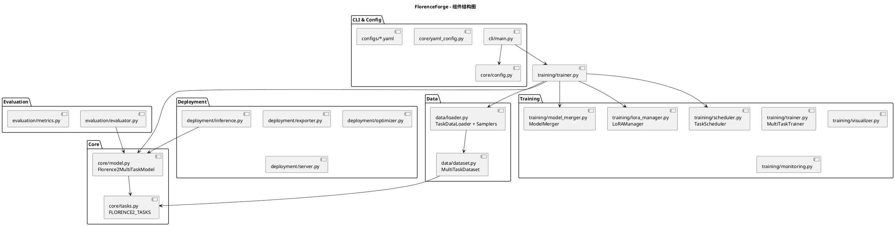
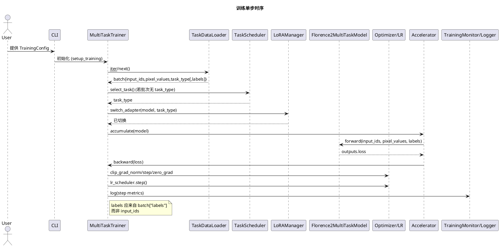
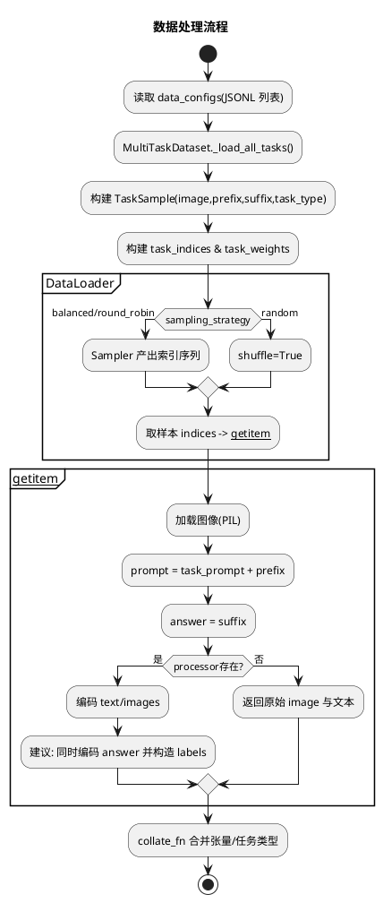
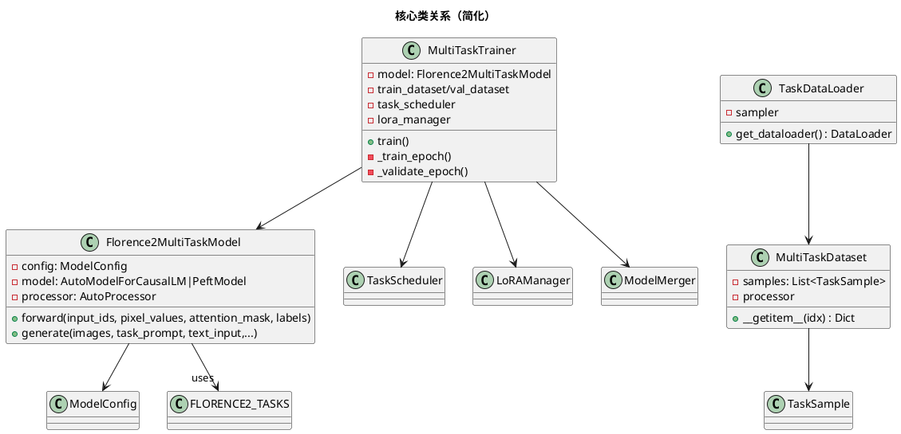
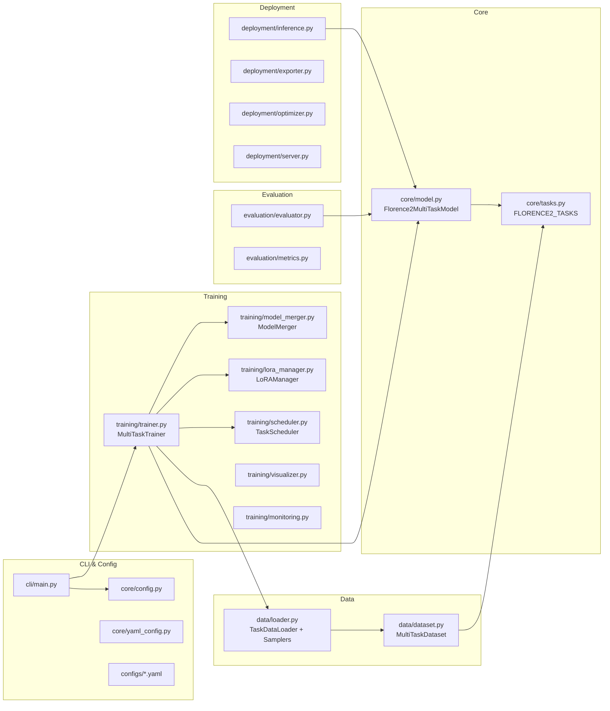

# FlorenceForge 架构剖析与优化建议

本文对当前代码框架进行结构化分析，聚焦架构设计、核心模块交互与性能瓶颈。文末附 4 张 PlantUML 图（组件结构、训练时序、数据流程、类关系），可直接复制渲染。

## 1. 分层架构与职责

- 接口/配置层
  - core/config.py：TrainingConfig/ModelConfig/DataConfig/OptimizationConfig/TaskSchedulingConfig 统一参数定义与序列化
  - core/yaml_config.py, configs/*, cli/*：配置装载、命令行入口与运行参数组织
- 核心模型层
  - core/model.py：Florence2MultiTaskModel 封装 HF AutoModelForCausalLM + AutoProcessor；加载、可选 LoRA、forward/generate、任务级推理
  - core/tasks.py：任务枚举与 FLORENCE2_TASKS（包含 prompt、是否需要 text_input、输出类型、默认生成参数）
- 数据层
  - data/dataset.py：MultiTaskDataset 从 JSONL 装载 TaskSample，构造 prompt/answer；如有 processor 则编码任务 token 与图像
  - data/loader.py：TaskDataLoader 与自定义采样器（balanced/round_robin/random），collate_fn 汇总批次并附带任务信息
- 训练层
  - training/trainer.py：MultiTaskTrainer 训练循环、验证、日志、检查点、早停；协调 TaskScheduler、LoRAManager、ModelMerger、TrainingVisualizer、TrainingMonitor
  - training/scheduler.py：轮询/加权/课程/自适应调度策略与权重自调整
  - training/lora_manager.py：按任务的 LoRA 配置与适配器管理（当前实现有关键缺失，详见下文）
  - training/model_merger.py：LoRA 权重合并与导出（若干与核心模型封装不匹配处，详见下文）
- 评估/部署层
  - evaluation/*：评估流程与指标
  - deployment/*：导出、推理与服务化

## 2. 关键模块交互与数据路径

- 数据路径
  1) MultiTaskDataset 读取 JSONL（image, prefix, suffix, task_type）→ 生成 TaskSample 列表
  2) __getitem__：加载图像 → 构造 prompt=task_prompt+prefix, answer=suffix；如有 processor，仅编码任务 token 与图像（未编码 answer）
  3) TaskDataLoader 使用 Sampler 产出索引 → collate_fn 汇总张量、标注 task_type/task_types

- 训练主循环（training/trainer.py）
  1) setup_training：初始化 TaskScheduler、可选 LoRAManager/ModelMerger、DataLoader、Optimizer/LR Scheduler；加速器装配
  2) 每步：
     - 确定 task_type（来自 batch 或调度器）
     - 切换 LoRA 适配器（若使用）
     - 前向：model(input_ids, pixel_values, attention_mask, labels=?) 计算 loss
     - 反向与优化：backward → clip_grad_norm → optimizer.step → lr_scheduler.step → zero_grad
     - 调度器更新性能、记录日志/监控、按周期保存检查点

- 推理路径（core/model.py）
  - predict_task → get_task_config → generate(images, task_prompt, text_input?) → processor(text=prompt, images) → model.generate → batch_decode → 简单清理前缀

## 3. 训练与推理路径要点

- 训练应以“prompt+answer”为目标序列，对 prompt 部分打 -100 掩码，仅监督 answer；当前实现未构建 labels，且- get_task_distribution 兼容 "task_type"/"task_types" 两种情况
  - pin_memory 仅在 CUDA/MPS 时启用；num_workers/persistent_workers/prefetch_factor 调优
- 步级指标：
  - 聚合缓冲后批量写 CSV，或仅使用 accelerator.log，epoch 末落盘

P2 鲁棒性与开发体验
- core/model.py::generate 在 processor 为 None 时给出明确异常与安装提示；或懒加载
- 早停指标键名对齐：_validate_epoch 返回 'loss'，与 metric_for_best_model 映射一致
- 增加训练阶段 data_time、forward_time、backward_time、optim_time 细分计时便于定位瓶颈
误用 labels=input_ids
- 设备/精度选择应由 TrainingConfig 驱动（CUDA/MPS/CPU，fp16/bf16/amp），避免强制 CPU float32

## 4. 主要性能与正确性瓶颈（按影响度排序）

1) 训练监督信号错误（致命正确性）
   - 位置：training/trainer.py::_train_epoch
   - 问题：labels 被设置为 input_ids（即任务 token），未监督生成 answer；dataset 也未编码 answer/labels
   - 结果：模型无法学习任务输出，loss 含义异常，验证无效

2) 强制 CPU + float32（重大性能）
   - 位置：core/model.py::_load_model
   - 问题：device_map="cpu"、torch_dtype=torch.float32 固定；忽略 TrainingConfig.device/use_fp16/use_bf16
   - 结果：训练/推理显著变慢，无法使用 GPU/MPS/AMP

3) LoRA 管理未闭环（功能缺失）
   - 位置：training/lora_manager.py
     - apply_lora_to_model 未调用 get_peft_model 且返回未定义变量 peft_model
     - add_adapter_to_model 仅登记未注入
   - 位置：training/trainer.py
     - setup_training 未将任务适配器真正添加到模型
   - 结果：多任务 LoRA 策略形同虚设

4) ModelMerger 与核心封装不匹配（合并导出不稳定）
   - 位置：training/model_merger.py
     - _create_merged_model 以 type(base_model)(model_name=..., device=...) 构造，不符合 Florence2MultiTaskModel 的 __init__(ModelConfig)
     - 访问 base_model.model_name，应使用 base_model.config.model_name
     - validate_merged_model/generate 的调用参数与封装签名不一致
   - 结果：合并/导出/验证易在运行期出错

5) DataLoader 统计与采样细节（稳定性/小错）
   - 位置：data/loader.py
     - get_task_distribution 使用 defaultdict 未导入；且无 "task_types" 键时会 KeyError
     - pin_memory=True 在 CPU 训练下无益
     - collate_fn 空批回退 dummy 样本，可能掩盖数据问题

6) processor 缺失时的鲁棒性
   - 位置：core/model.py
     - AutoProcessor 不可用时 generate 仍会用 None 触发异常，需显式报错或懒加载

7) 频繁 CSV 写入（IO 抖动）
   - 位置：training/trainer.py::_record_step_metrics
   - 问题：步级频繁落盘 CSV，阻塞训练循环

## 5. 优先级优化与修复清单

P0 正确性
- 构造正确的 labels（仅监督 answer）
  - data/dataset.py::__getitem__：
    - 使用 processor 同时编码 prompt 与 answer（或 prompt 单独输入、labels 对齐 answer）
    - 构造 labels：prompt token 位置置 -100，answer token 为真实标签
    - 返回 {input_ids, labels, pixel_values, attention_mask, task_type, ...}
  - training/trainer.py::_train_epoch：
    - 改为 labels=batch["labels"]，不要 labels=input_ids
- 设备/精度遵从配置
  - core/model.py::_load_model：
    - 读取 ModelConfig/TrainingConfig 决定 device_map、dtype、attn_implementation
    - CUDA/MPS 可用时启用 AMP（与 accelerate 相一致），保留 flash_attn 检测但不强制降级

P0 LoRA 闭环
- training/lora_manager.py：
  - apply_lora_to_model：调用 get_peft_model(model, LoraConfig(...), adapter_name=...)，返回 PeftModel 并登记 active_adapters
  - add_adapter_to_model：对已有 PeftModel 调用 add_adapter(adapter_name, peft_config)
- training/trainer.py::setup_training：
  - 为每个 task 创建/添加 adapter（一次性），训练步按 task_type 切换 adapter

P1 合并/导出适配
- training/model_merger.py：
  - _create_merged_model 使用 Florence2MultiTaskModel(ModelConfig(...)) 正确构造；注意底层 huggingface 模型 state_dict 映射
  - 统一通过 base_model.config 访问属性
  - validate_merged_model 以封装 generate(images=..., task_prompt=...) 流程验证

P1 数据/加载器与 IO
- data/loader.py：
  - 补充 from collections import defaultdict
  
## 6. 建议的监控与度量

- 吞吐：images/sec（按设备/精度维度记录）
- 时延分解：data_time/forward/backward/optim
- 显存：CUDA memory 使用峰值与碎片
- 任务分布：TaskScheduler recent_distribution 与 loss 曲线对齐
- 数据：DataLoader num_workers/prefetch/pin_memory 网格搜索记录

## 7. PlantUML 图表

下列 4 张图可直接用 PlantUML 渲染（建议保存到 docs/ 供团队共享）。

1) 组件结构图


2) 训练单步时序图


3) 数据处理流程图


4) 核心类关系图（简化）


---
建议将本文作为 PR 讨论基线：先落地 P0 修复（监督信号/设备精度/LoRA 闭环），再推进 P1（合并导出/数据加载器/IO），最后完善 P2（鲁棒性与监控）。

## Mermaid 图（等价）

- 组件结构图


- 数据处理流程图
```mermaid
flowchart TD
  A[读取 data_configs(JSONL 列表)] --> B[MultiTaskDataset._load_all_tasks]
  B --> C[构建 TaskSample(image,prefix,suffix,task_type)]
  C --> D[构建 task_indices & task_weights]
  D --> E{sampling_strategy?}
  E -->|balanced/round_robin| F[自定义 Sampler 产出索引]
  E -->|random| G[DataLoader shuffle=True]
  F --> H[__getitem__ 取样本]
  G --> H
  H --> I[加载图像(PIL)]
  I --> J[prompt = task_prompt + prefix]
  J --> K[answer = suffix]
  K --> L{processor 存在?}
  L -->|是| M[编码 text/images;\n构造 labels: prompt->-100, answer->ids]
  L -->|否| N[返回原始 image 与文本]
  M --> O[collate_fn 合并张量/任务类型]
  N --> O
  O --> P[批次输出到 Trainer]
```
