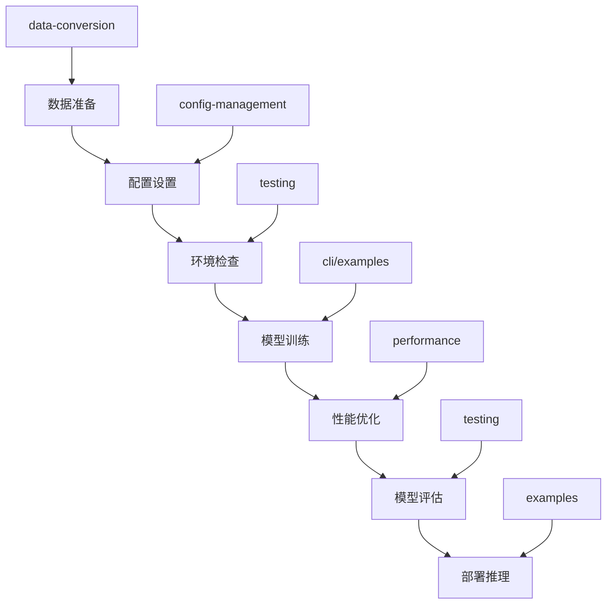

# Florence Forge 脚本工具集

本目录包含 Florence Forge 项目的各种脚本工具，按功能分类组织，为用户提供完整的工具链支持。

## 📁 目录结构

```
scripts/
├── cli/                    # CLI 工具脚本
├── data-conversion/        # 数据转换脚本
├── testing/               # 测试和验证脚本
├── performance/           # 性能优化和质量检查脚本
├── config-management/     # 配置管理脚本
├── examples/              # 示例和教程脚本
├── training/              # 训练相关脚本
└── __init__.py           # 模块初始化文件
```

## 🚀 快速开始

### 1. 环境准备
```bash
# 确保已安装 Florence Forge
pip install -e .

# 检查环境
python scripts/testing/quick_check.py --system
```

### 2. 基础使用
```bash
# CLI 工具
python scripts/cli/florence_cli.py --help

# 快速测试
python scripts/testing/quick_test.py

# 运行示例
python scripts/examples/example_runner.py --interactive
```

### 3. 常用工作流
```bash
# 数据准备 → 配置设置 → 训练 → 评估
python scripts/data-conversion/batch_data_conversion.py --input data/ --output converted/
python scripts/config-management/advanced_config_manager.py --generate-template --task object_detection
python scripts/config-management/train_with_yaml.py --config config.yaml
python scripts/testing/validation_suite.py --validate-model model.pth
```

## 📋 脚本分类详解

### [CLI 工具](./cli/)
命令行界面工具，提供统一的用户交互接口。

**主要脚本：**
- `florence_cli.py` - 主要 CLI 工具

**功能特性：**
- 🎯 训练模型管理
- 📊 数据集处理
- ⚙️ 配置文件管理
- 🔍 模型评估和推理

**快速使用：**
```bash
# 查看帮助
python scripts/cli/florence_cli.py --help

# 训练模型
python scripts/cli/florence_cli.py train --config config.yaml
```

### [数据转换](./data-conversion/)
数据格式转换和批量数据处理工具。

**主要脚本：**
- `batch_data_conversion.py` - 批量数据转换
- `data_conversion_examples.py` - 转换示例
- `convert/convert_yolo.sh` - YOLO 格式转换

**支持格式：**
- 📥 输入：COCO, YOLO, Pascal VOC, 自定义 JSON
- 📤 输出：Florence, JSONL, CSV

**快速使用：**
```bash
# 批量转换
python scripts/data-conversion/batch_data_conversion.py \
  --input coco_data/ --output florence_data/ --format florence
```

### [测试验证](./testing/)
测试、验证和质量检查工具。

**主要脚本：**
- `quick_test.py` - 快速测试
- `test_runner.py` - 测试运行器
- `validation_suite.py` - 验证套件
- `quick_check.py` - 快速检查
- `simple_test.py` - 简单测试

**测试类型：**
- 🧪 单元测试
- 🔗 集成测试
- 🎯 端到端测试
- ⚡ 性能测试

**快速使用：**
```bash
# 快速测试
python scripts/testing/quick_test.py

# 完整测试套件
python scripts/testing/test_runner.py --all
```

### [性能优化](./performance/)
性能优化、基准测试和代码质量检查工具。

**主要脚本：**
- `performance_optimizer.py` - 性能优化器
- `benchmark_tools.py` - 基准测试工具
- `code_quality_checker.py` - 代码质量检查

**优化领域：**
- 🚀 训练性能优化
- 💾 内存使用优化
- 🎮 GPU 利用率优化
- 📈 推理速度优化

**快速使用：**
```bash
# 性能分析
python scripts/performance/performance_optimizer.py --analyze-training

# 基准测试
python scripts/performance/benchmark_tools.py --full-benchmark
```

### [配置管理](./config-management/)
配置文件管理和 YAML 配置处理工具。

**主要脚本：**
- `advanced_config_manager.py` - 高级配置管理
- `run_with_yaml_config.py` - YAML 配置运行
- `train_with_yaml.py` - YAML 训练配置

**配置功能：**
- 📝 配置模板生成
- ✅ 配置验证校验
- 🔄 配置继承覆盖
- 🌍 多环境配置

**快速使用：**
```bash
# 生成配置模板
python scripts/config-management/advanced_config_manager.py \
  --generate-template --task object_detection

# 使用配置训练
python scripts/config-management/train_with_yaml.py --config config.yaml
```

### [示例教程](./examples/)
各种使用示例、教程脚本和演示程序。

**主要脚本：**
- `config_usage_example.py` - 配置使用示例
- `example_runner.py` - 示例运行器
- `usage_examples.py` - 使用示例集合
- `run_all.py` - 批量运行脚本

**示例类型：**
- 🎓 基础入门示例
- 🏋️ 训练示例
- 🔮 推理示例
- 📊 数据处理示例
- 📈 评估示例

**快速使用：**
```bash
# 交互式示例选择
python scripts/examples/example_runner.py --interactive

# 运行特定示例
python scripts/examples/usage_examples.py --example training
```

### [训练脚本](./training/)
训练相关的专用脚本和工具。

**主要内容：**
- `training_od.sh` - 目标检测训练脚本
- `outputs/` - 训练输出目录

**快速使用：**
```bash
# 运行目标检测训练
./scripts/training/training_od.sh
```

## 🛠️ 工具链工作流

### 完整开发流程



### 1. 数据准备阶段
```bash
# 数据格式转换
python scripts/data-conversion/batch_data_conversion.py \
  --input raw_data/ --output processed_data/ --format florence

# 数据验证
python scripts/testing/validation_suite.py --validate-data processed_data/
```

### 2. 配置设置阶段
```bash
# 生成配置模板
python scripts/config-management/advanced_config_manager.py \
  --generate-template --task object_detection --output config.yaml

# 验证配置
python scripts/config-management/advanced_config_manager.py \
  --validate config.yaml
```

### 3. 环境检查阶段
```bash
# 系统环境检查
python scripts/testing/quick_check.py --system

# 快速功能测试
python scripts/testing/quick_test.py
```

### 4. 模型训练阶段
```bash
# 使用 CLI 训练
python scripts/cli/florence_cli.py train --config config.yaml

# 或使用配置脚本训练
python scripts/config-management/train_with_yaml.py --config config.yaml
```

### 5. 性能优化阶段
```bash
# 性能分析
python scripts/performance/performance_optimizer.py \
  --analyze-training --config config.yaml

# 基准测试
python scripts/performance/benchmark_tools.py --benchmark-training
```

### 6. 模型评估阶段
```bash
# 模型验证
python scripts/testing/validation_suite.py --validate-model model.pth

# 完整测试
python scripts/testing/test_runner.py --type integration
```

### 7. 部署推理阶段
```bash
# 推理示例
python scripts/examples/usage_examples.py --example inference

# 批量推理
python scripts/cli/florence_cli.py inference --model model.pth --input images/
```

## 📊 脚本使用统计

### 按功能分类
| 分类 | 脚本数量 | 主要用途 | 使用频率 |
|------|----------|----------|----------|
| CLI 工具 | 1 | 用户交互 | ⭐⭐⭐⭐⭐ |
| 数据转换 | 3 | 数据处理 | ⭐⭐⭐⭐ |
| 测试验证 | 5 | 质量保证 | ⭐⭐⭐⭐⭐ |
| 性能优化 | 3 | 性能提升 | ⭐⭐⭐ |
| 配置管理 | 3 | 配置处理 | ⭐⭐⭐⭐ |
| 示例教程 | 4 | 学习参考 | ⭐⭐⭐⭐ |
| 训练脚本 | 1 | 专用训练 | ⭐⭐⭐ |

### 使用场景映射
| 使用场景 | 推荐脚本 | 难度等级 |
|----------|----------|----------|
| 快速开始 | `examples/example_runner.py` | 🟢 初级 |
| 数据准备 | `data-conversion/batch_data_conversion.py` | 🟡 中级 |
| 模型训练 | `cli/florence_cli.py` | 🟡 中级 |
| 性能调优 | `performance/performance_optimizer.py` | 🔴 高级 |
| 问题诊断 | `testing/validation_suite.py` | 🟡 中级 |
| 配置管理 | `config-management/advanced_config_manager.py` | 🟡 中级 |

## 🔧 高级用法

### 脚本组合使用

#### 自动化工作流
```bash
#!/bin/bash
# automated_workflow.sh

# 1. 数据转换
python scripts/data-conversion/batch_data_conversion.py \
  --input $INPUT_DIR --output $PROCESSED_DIR

# 2. 配置生成
python scripts/config-management/advanced_config_manager.py \
  --generate-template --task $TASK --output config.yaml

# 3. 环境检查
python scripts/testing/quick_check.py --system || exit 1

# 4. 开始训练
python scripts/config-management/train_with_yaml.py --config config.yaml

# 5. 性能分析
python scripts/performance/performance_optimizer.py --analyze-training

# 6. 模型验证
python scripts/testing/validation_suite.py --validate-model $MODEL_PATH
```

#### 并行执行
```bash
# 并行运行多个测试
python scripts/examples/run_all.py --category testing --parallel --workers 4

# 并行基准测试
python scripts/performance/benchmark_tools.py --parallel-benchmark
```

### 脚本扩展

#### 自定义脚本模板
```python
#!/usr/bin/env python3
# custom_script_template.py
"""
自定义脚本模板

使用方法:
    python custom_script_template.py [options]
"""

import argparse
import logging
from pathlib import Path

# 导入 Florence Forge 模块
from florence_forge import Florence2Model
from florence_forge.utils import setup_logging

def main():
    """主函数"""
    parser = argparse.ArgumentParser(description="自定义脚本")
    parser.add_argument("--config", type=str, help="配置文件路径")
    parser.add_argument("--verbose", action="store_true", help="详细输出")
    
    args = parser.parse_args()
    
    # 设置日志
    setup_logging(verbose=args.verbose)
    
    # 实现自定义逻辑
    logging.info("开始执行自定义脚本")
    
    # 您的代码逻辑
    
    logging.info("脚本执行完成")

if __name__ == "__main__":
    main()
```

## 📚 相关文档

### 详细文档链接
- [CLI 工具文档](../docs/cli/)
- [用户指南](../docs/user-guides/)
- [配置管理文档](../docs/configuration/)
- [开发文档](../docs/development/)
- [API 参考](../docs/reference/)

### 快速参考
- [CLI 快速参考](../docs/cli/CLI_QUICK_REFERENCE.md)
- [配置参数说明](../docs/configuration/config_guide.md)
- [故障排除指南](../docs/cli/CLI_TROUBLESHOOTING.md)

## 🆘 获取帮助

### 内置帮助
```bash
# 查看脚本帮助
python scripts/[category]/[script].py --help

# 查看 CLI 工具帮助
python scripts/cli/florence_cli.py --help

# 查看示例列表
python scripts/examples/example_runner.py --list
```

### 问题诊断
```bash
# 系统诊断
python scripts/testing/quick_check.py --system --verbose

# 配置诊断
python scripts/config-management/advanced_config_manager.py \
  --validate config.yaml --deep

# 性能诊断
python scripts/performance/performance_optimizer.py --diagnose
```

### 社区支持
- 📖 **文档中心**：查看完整文档
- 💬 **讨论区**：参与社区讨论
- 🐛 **问题报告**：提交 Issues
- 🤝 **贡献指南**：参与项目开发

## ⚠️ 注意事项

### 环境要求
- **Python 版本**：3.8+
- **依赖安装**：`pip install -e .`
- **GPU 支持**：CUDA 11.0+ (可选)
- **内存要求**：建议 16GB+ RAM

### 使用建议
1. **首次使用**：先运行 `quick_check.py` 检查环境
2. **数据准备**：确保数据格式正确
3. **配置验证**：训练前验证配置文件
4. **资源监控**：注意 GPU 和内存使用
5. **备份重要**：定期备份模型和配置

### 常见问题
1. **权限问题**：确保脚本有执行权限
2. **路径问题**：使用绝对路径或正确的相对路径
3. **依赖问题**：检查所有依赖是否正确安装
4. **内存不足**：减少批处理大小或使用更小的模型

## 🔄 版本更新

### 脚本版本
- **当前版本**：v1.0.0
- **最后更新**：2024-03-20
- **兼容性**：Florence Forge v1.0+

### 更新日志
- **v1.0.0**：初始版本，包含所有基础脚本
- 按功能重新组织脚本结构
- 添加详细的文档和示例
- 提供完整的工具链支持

---

**Florence Forge 脚本工具集** - 让 AI 模型开发更简单、更高效！ 🚀